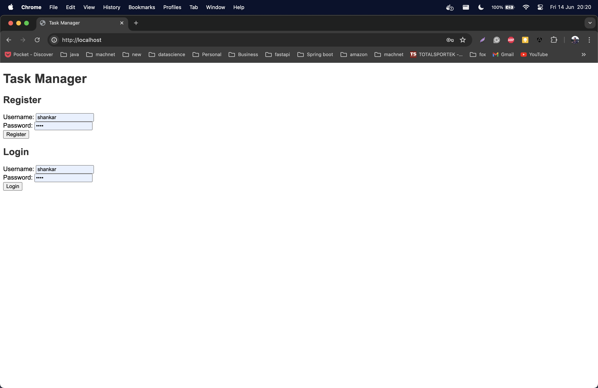
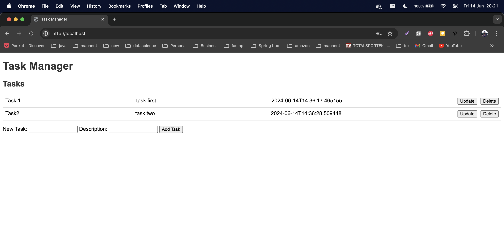

# Task Management System

## Prerequisites
Make sure you have the following installed:
* Java 17
* docker


## Tech Stack
* SpringBoot 3
* Postgres
* java 17
* gradle


## Building the Project
Run the following command to build the project:

```bash
./gradlew build
```

After successful build

```bash
docker-compose up --build -d

```
* backend server will run on port 8080
* frontend will be hosted in port 80

Widget
```
http://localhost/
```

Login Page



Task Page



#### Additional Configuration
For any additional configuration or customization, refer to the project's build.gradle file.
